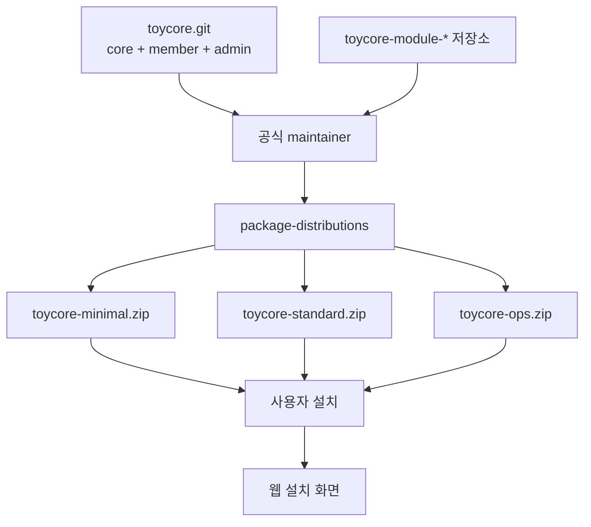

# 서버별 배포 예시

Toycore는 루트의 `index.php`를 공개 진입점으로 사용합니다. 저가형 웹호스팅에서는 문서 루트와 쓰기 권한을 먼저 확인합니다.

이 문서는 예시만 제공합니다. 프로젝트에는 `.htaccess`를 포함하지 않습니다.

## 공통 준비

필수 확인:

```text
PHP 8.1 이상
PDO MySQL 확장
MySQL 또는 MariaDB
config 디렉터리 쓰기 가능
storage 디렉터리 쓰기 가능
```

설치 후에는 다음 파일이 생성됩니다.

```text
config/config.php
storage/installed.lock
```

이 파일들은 Git에 포함하지 않습니다.

## 배포 패키지 종류

Toycore 본체 소스는 core/member/admin 중심으로 유지하고, 배포 산출물은 필요에 따라 선택 모듈을 조립해 나눕니다.
공식 배포 조합은 `docs/distributions.json`을 기준으로 하며, 패키징과 검증, 설치 화면 기본 선택값이 이 파일을 읽습니다.

```text
toycore-minimal
- core
- member
- admin

toycore-standard
- toycore-minimal
- seo
- site_menu
- banner

toycore-ops
- toycore-standard
- popup_layer
- point
- deposit
- reward
- notification
```

이 배포 패키지는 일반 설치자가 직접 만드는 대상이 아니라 Toycore 공식 maintainer가 조립해 제공하는 설치용 결과물이다.

릴리스 제작 결과:

```text
dist/toycore-minimal
dist/toycore-standard
dist/toycore-ops
```

`zip` 명령을 사용할 수 있으면 같은 이름의 zip 파일도 생성됩니다. minimal 배포본에는 선택 모듈 코드가 없으므로 설치 화면에서 선택 모듈 목록이 비어 있을 수 있습니다. 설치 후 필요한 모듈 zip을 `modules/{module_key}`에 업로드하고 `/admin/modules`에서 설치합니다.

공식 maintainer가 standard/ops 패키지를 만들 때는 toycore.git과 같은 상위 디렉터리에 `toycore-module-seo`, `toycore-module-popup-layer` 같은 외부 모듈 리포지토리가 있어야 합니다. 다른 위치에 있다면 `TOYCORE_MODULE_REPO_ROOT` 환경변수로 모듈 리포지토리 상위 디렉터리를 지정합니다.



## 설치 방식 선택

릴리스 zip 설치는 Git을 사용할 수 없는 호스팅에서 가장 단순하다. 하지만 zip만 업로드한 운영 서버는 Git 이력이 없으므로, 현재 운영 파일이 어떤 태그에서 왔는지 확인하거나 다음 릴리스와의 차이를 검토하기 어렵다. 업데이트를 반복할 운영 사이트라면 Git 기반 설치를 우선 검토한다.

권장 기준:

```text
Git 사용 가능, SSH 또는 배포 자동화 가능
-> clone 또는 fork 기반 설치

Git 불가, FTP/SFTP 또는 파일 관리자만 가능
-> release zip 설치
```

현재 `toycore.git` 본체를 그대로 clone하면 core/member/admin 중심의 minimal 수준이다. `standard`나 `ops`까지 Git으로 바로 설치하려면 선택 모듈이 이미 포함된 release zip, 배포 브랜치, 또는 별도 배포 저장소 같은 조립 완료 기준점이 필요하다.

공식 코드를 그대로 운영하고 서버에서 직접 수정하지 않는 minimal 설치라면 clone으로 충분하다.

```sh
git clone https://github.com/whitedot/toycore.git toycore
cd toycore
git checkout v0.1.1
```

위의 `v0.1.1`은 현재 공개 릴리스 예시다. 실제 설치할 때는 원하는 릴리스 태그를 사용한다.

운영자가 자체 패치, 전용 모듈 조립, 호스팅별 배포 스크립트를 함께 관리해야 한다면 fork를 만든 뒤 fork를 운영 기준 저장소로 둔다. 공식 저장소는 `upstream`으로 추가해 새 릴리스를 가져온다.

```sh
git clone git@github.com:your-org/toycore.git toycore
cd toycore
git remote add upstream https://github.com/whitedot/toycore.git
git fetch upstream --tags
git checkout -b release/<release-tag> <release-tag>
```

릴리스 업데이트 절차:

```text
1. 운영 DB와 파일 백업
2. 스테이징에서 git fetch upstream --tags
3. 새 릴리스 태그 병합 또는 rebase
4. 충돌과 로컬 패치 확인
5. 웹 설치 상태와 관리자 로그인 확인
6. /admin/updates에서 미적용 SQL 검토 후 실행
7. 운영 서버에 같은 commit 배포
```

운영 서버에서 바로 `main`을 따라가지 않는다. 운영 반영 기준은 릴리스 태그 또는 검증된 운영 브랜치의 commit SHA로 고정한다. `config/config.php`, `storage/installed.lock`, `storage/logs`, `storage/module-backups`는 Git에 포함하지 않는다.

릴리스 zip만 사용할 수 있는 호스팅에서는 업로드한 zip 파일명, 릴리스 태그, `distribution-manifest.json`의 포함 모듈 버전/계약 정보, 적용 일자를 운영 기록으로 남긴다. 다음 업데이트 때는 기존 파일을 덮어쓰기 전에 파일 백업을 만들고, zip 교체 후 `/admin/updates`에서 DB 업데이트를 실행한다.

## Maintainer 패키징

`package-distributions`는 사용자 설치 명령이 아니라 릴리스 제작 명령이다. toycore 본체와 선택 모듈 저장소를 같은 상위 디렉터리에 둔 뒤 실행한다.

```text
workspace/
- toycore/
- toycore-module-seo/
- toycore-module-site-menu/
- toycore-module-banner/
- toycore-module-popup-layer/
- toycore-module-point/
- toycore-module-deposit/
- toycore-module-reward/
- toycore-module-notification/
```

```sh
cd toycore
./.tools/bin/package-distributions 2026.05.001
```

이 명령은 각 모듈 저장소의 `module/` 디렉터리를 읽어 `dist/toycore-standard`와 `dist/toycore-ops`의 `modules/{module_key}` 아래로 복사한다. 생성된 `dist/`는 운영 사이트가 계속 참조하는 디렉터리가 아니라, zip으로 배포하거나 운영 위치에 배치할 설치용 결과물이다.

## PHP 내장 서버

로컬 확인용입니다.

```sh
./.tools/bin/php -S 127.0.0.1:8080 index.php
```

브라우저에서 `http://127.0.0.1:8080/`로 접속합니다.

## Apache 가상 호스트

서버 설정을 직접 수정할 수 있는 환경에서는 문서 루트를 프로젝트 루트로 지정하고 모든 요청을 `index.php`로 전달합니다.

```apache
<VirtualHost *:80>
    ServerName example.com
    DocumentRoot /var/www/toycore

    <Directory /var/www/toycore>
        Require all granted
        DirectoryIndex index.php
        FallbackResource /index.php
    </Directory>
</VirtualHost>
```

`FallbackResource`를 사용할 수 없는 공유호스팅에서는 호스팅 패널의 프론트 컨트롤러, 기본 문서, 오류 문서 설정을 먼저 확인합니다. 프로젝트 자체에는 `.htaccess`를 추가하지 않습니다.

## Nginx

서버 설정을 직접 수정할 수 있는 환경에서는 `try_files`로 `index.php`에 전달합니다.

```nginx
server {
    listen 80;
    server_name example.com;
    root /var/www/toycore;
    index index.php;

    location / {
        try_files $uri /index.php?$query_string;
    }

    location ~ \.php$ {
        include fastcgi_params;
        fastcgi_param SCRIPT_FILENAME $document_root$fastcgi_script_name;
        fastcgi_pass unix:/run/php/php8.3-fpm.sock;
    }
}
```

## 로드밸런서와 클라우드 런타임

설치 후 `config/config.php`에서 운영 환경에 맞게 다음 값을 조정한다.

```php
'security' => [
    'force_https' => true,
    'trusted_proxies' => ['10.0.0.0/8'],
],
'session' => [
    'handler' => 'database',
    'lifetime_seconds' => 86400,
],
'secrets' => [
    'app_key_env' => 'TOY_APP_KEY',
],
'mail' => [
    'transport' => 'smtp',
    'from_email' => 'no-reply@example.com',
    'from_name' => 'Toycore',
    'host' => 'smtp.example.com',
    'port' => 587,
    'encryption' => 'tls',
    'username' => 'smtp-user',
    'password' => 'smtp-password',
    'endpoint' => '',
    'bearer_token' => '',
],
```

`trusted_proxies`에는 PHP가 직접 보는 로드밸런서 또는 리버스 프록시의 IP/CIDR만 넣는다. 이 값이 맞아야 `X-Forwarded-Proto` 기반 HTTPS 판단, Secure 쿠키, 실제 클라이언트 IP 기반 인증 제한이 올바르게 동작한다. 값은 단일 IP(`203.0.113.10`) 또는 CIDR(`10.0.0.0/8`, `2001:db8::/32`) 형식이어야 하며, 잘못된 항목은 런타임에서 신뢰 대상으로 사용하지 않는다.

`app_key_env`를 사용하면 환경변수 또는 secret manager에서 앱 비밀값을 주입할 수 있다. 운영 중 `app_key`를 바꾸면 로그인 식별자 HMAC 조회가 깨질 수 있으므로 기존 값과 동일한 값을 주입해야 한다.

`mail.transport`는 `php_mail`, `smtp`, `http_api`를 지원한다. `smtp`와 `http_api`는 `from_email`이 유효한 이메일이어야 하며, `http_api`는 `endpoint`와 선택적인 `bearer_token`을 사용해 JSON payload를 전송한다. HTTP API endpoint는 공개망 HTTPS URL이어야 하며, localhost, 사설망, link-local, 예약 IP 주소는 인증 메일 발송 대상으로 사용하지 않는다.

## 공유호스팅

서버 설정을 직접 수정할 수 없는 환경에서는 다음 순서로 확인합니다.

```text
1. 문서 루트를 Toycore 프로젝트 루트로 지정할 수 있는지 확인
2. index.php가 기본 문서로 실행되는지 확인
3. config와 storage가 쓰기 가능한지 확인
4. 설치 화면에서 DB host, DB 이름, DB 사용자, DB 비밀번호 입력
5. 설치 후 config/config.php와 storage/installed.lock 생성 확인
```

요청 재작성 기능을 설정할 수 없다면, 초기 운영은 루트 요청과 명시적 PHP 진입 방식부터 확인합니다. Toycore는 배포 환경의 제약을 숨기기보다 운영자가 확인할 수 있게 유지합니다.

FTP, SFTP, 호스팅 패널 중심의 실제 설치 순서는 [저가형 호스팅 설치 절차](shared-hosting-install.md)를 따른다.
